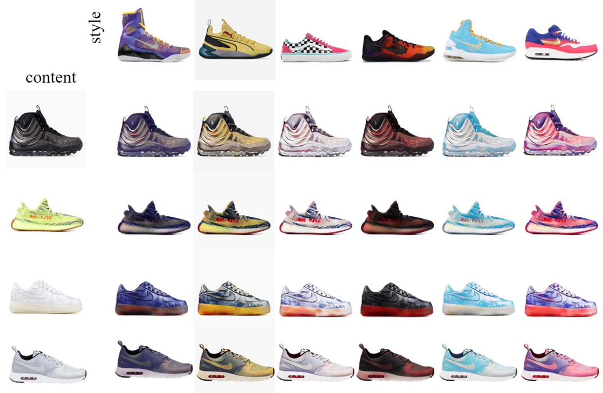

## Domain Flow for Mixture Style Generation on Latent Space Exploration and Control
## 流域應用於隱空間探索與控制完成混合風格生成
----------------------------------------------------------------------------------------
## Code 參考
參考 [MUNIT: Multimodal UNsupervised Image-to-image Translation](https://github.com/NVlabs/MUNIT) 和
[DLOW-Pytorch](https://github.com/Euiyeon-Kim/DLOW-Pytorch)

### Code usage

Please check out the [user manual page](USAGE.md).

### Concept 

### System Framework

總共分為兩個部分 Disentangle 和 Domain Flowing。

### Disentangle Visualization

#### multiple2one

#### one2multiple

#### noise sample

### Domain Flowing Visualization

